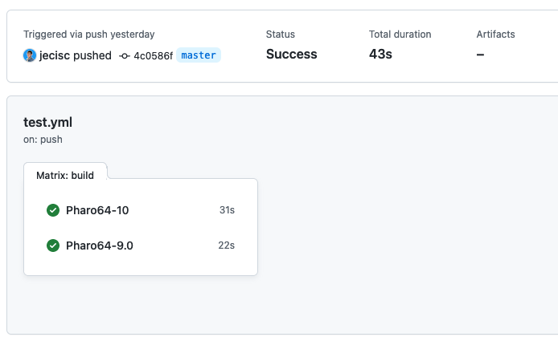
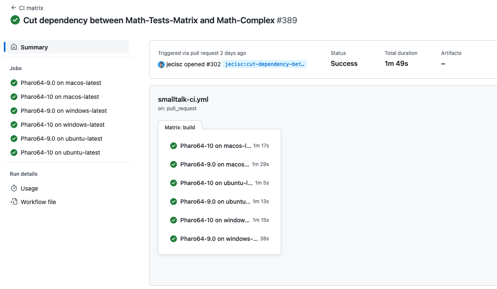

# Setting up your continuous integration via Github Actions

Previously, the Pharo community was heavily relying on Travis CI for continuous integration of projects hosted on GitHub.
But Travis becoming a pay to use service, the community created some tooling to manage the CI via Github Actions. 

This guide will get you through the process to setup your own integration.

## Simple case: Run tests on master branch

Let's start simple! This section will explain how to setup a workflow to launch the tests of the project on every commit done on master branch.

To load our Pharo project in the CI and execute the tests, we'll use [SmalltalkCI](https://github.com/hpi-swa/smalltalkCI).
This project needs a configuration file to fetch informations on your project. This file should be at the root of your project under the name of `.smalltalk.ston`. 

Here is the most simple configuration:

```ston
SmalltalkCISpec {
  #loading : [
    SCIMetacelloLoadSpec {
      #baseline : 'MyProject',
      #directory : 'src'
    }
  ]
}
```

This configuration tells smalltalkCI two things:
- The sources of the project are in /src
- The baseline to use to load the project is BaselineOfMyProject

Now that smalltalkCI configuration file is created, we just need to define your github workflow file.
This file should be located in `.github/workflows/` folder. Lets call ours `testing.yml`.

```yml
name: CI

env:
  GITHUB_TOKEN: ${{ secrets.GITHUB_TOKEN }}

on:
  push:
    branches:
      - 'master'

jobs:
  build:
    runs-on: ubuntu-latest
    steps:
      - uses: actions/checkout@v2
      - uses: hpi-swa/setup-smalltalkCI@v1
        with:
          smalltalk-image: Pharo64-10
      - run: smalltalkci -s ${{ matrix.smalltalk }}
        shell: bash
        timeout-minutes: 15
```

Let's see a little what is happening here. 

The #name parameter allows one to give a name to the workflow. This is useful because you might have more than one workflow for your project. 
For example:


In this image we can see a CI that has 3 differents workflows:
- CI
- continuous
- Release

Then we have 

```yml
on:
  push:
    branches:
      - 'master'
```

This is used to define when the workflow should enter in action. In our case, we want it when we push on master branch.

Then we have:

```yml
    runs-on: ubuntu-latest
```

With this, the workflow will run in the latest version of ubuntu

Last but not least, we have the actions to execute:

```yml
    steps:
      - uses: actions/checkout@v2
      - uses: hpi-swa/setup-smalltalkCI@v1
        with:
          smalltalk-image: Pharo64-10
      - run: smalltalkci -s ${{ matrix.smalltalk }}
        shell: bash
        timeout-minutes: 15
```

This includes 3 steps:
- Using the "checkout" action to checkout the project on the CI slave
- Setup Smalltalk CI
- Run the loading of the project and the testing with a 15min timeout

This timeout can be increased in case your project tests are longer

Once you commit this, your project have a working CI and each time you commit to master, a new build should happen.

## SmalltalkCI options

We have seen in the previous section that [SmalltalkCI](https://github.com/hpi-swa/smalltalkCI) relies on a configuration file. 
We did a simple one to start, but there are more options available. We will cover them in this section.

### Load spec options

In the previous example we declared a load spec with a baseline and a code directory. But it is also possible to add more options:

```ston
SCIMetacelloLoadSpec {
  #baseline : 'MyProject',                            // Define MC Baseline
  #directory : 'src',                                 // Path to packages
  #failOn : [ #OCUndeclaredVariableWarning ],         // Fail build on provided list of Warnings
  #ignoreImage : true,                                // If true, Metacello will force a load of a package, overriding a previously existing one
  #load : [ 'default' ],                              // Define some specific groups to load
  #onConflict : #useIncoming,                         // When there is a conflict between loaded sources and incoming sources (can be #useIncoming|#useLoaded)
  #onUpgrade : #useIncoming,                          // When loaded sources are an older version than incoming sources (can be #useIncoming|#useLoaded)
  #onWarningLog : true,                               // Log Warning messages to Transcript
  #platforms : [ #squeak, #pharo, #gemstone ],        // Define compatible platforms
  #usernameEnvVar : 'GITHUB_USER',                    // Environment variable containing the username used for authentication
  #passwordEnvVar : 'GITHUB_TOKEN',                   // Environment variable containing the password used for authentication
  #registerInIceberg : true                           // Pharo Only | Register the tested repository in Iceberg (false by default)
}
```
### Testing options
It is also possible to customize the testing of the project:

```ston
SmalltalkCISpec {
  ...
  #testing : {
    // Include specific TestCases
    #include : {
      #classes : [ #AnotherProjectTestCase ],
      #categories : [ 'AnotherProject-Tests' ],
      #packages : [ 'AnotherProject.*' ],
      #projects : [ 'BaselineOfMyProject' ]
    },

    // Exclude specific TestCases from testing
    #exclude : {
      #classes : [ #AnotherProjectTestCase ],
      #categories : [ 'AnotherProject-Tests' ],
      #packages : [ 'AnotherProject.*' ],
      #projects : [ 'ConfigurationOfMyOtherProject' ]
    },

    #allTestCases : true, // Run all TestCases in image

    // Define TestCases explicitly
    #classes : [ #MyProjectTestCase ],
    #categories : [ 'MyProject-*' ],
    #packages : [ 'MyProject.*' ],
    #projects : [ 'BaselineOfMyProject' ],

    // Other options
    #defaultTimeout : 30, // In seconds (Squeak, and Pharo 6 or later)
    #failOnSCIDeprecationWarnings : false, // Fail if a deprecated smalltalkCI API is used
    #failOnZeroTests : false, // Pass builds that did not run any tests
    #hidePassingTests : true, // Hide passing tests when printing to stdout
    #serializeError: false // (default: true) Disable serialization of failing test case (e.g. with Fuel in Pharo)
  }
}
```

### Code Coverage

It is possible to see the coverage of our project via SmalltalkCI with [Coveralls](https://coveralls.io/).

To enable this, you need to add a "coverage" section in your configuration:

```ston
SmalltalkCISpec {
  ...
  #testing : {
    ...
    #coverage : {
      #packages : [ 'SomePackage', 'SomePack*' ],
      #classes : [ #ClassToCover ],
      #categories : [ 'SomeClassCategory', 'SomeClassCat*' ],
      #format : #coveralls
    }
  }
}
```

For example our project could look like:

```ston
SmalltalkCISpec {
  #loading : [
    SCIMetacelloLoadSpec {
      #baseline : 'Myproject',
      #directory : 'src'
    }
  ],
  #testing : {
    #coverage : {
      #packages : [ 'MyProject-*' ]
    }
  }
}
```

This configuration will execute all the tests loaded by the `BaselineOfMyProject` and build the coverage of all packages starting by `MyProject-` for [Coveralls](https://coveralls.io/).
If you enabled your repository in coveralls ([https://coveralls.io/repos/new](https://coveralls.io/repos/new)), the results will be uploaded automatically.


For more informations check: [SmalltalkCI guide on coverage](https://github.com/hpi-swa/smalltalkCI/blob/master/docs/COVERAGE.md).

### Using custom scripts

SmalltalkCI offers some hooks to be able to run some Pharo scripts at different moments of the project loading and testing.
Four hooks are availables:
- `preLoading` : Executed before loading the project
- `postLoading` : Executed after loading the project
- `preTesting` : Executed before testing the project
- `postTesting` : Executed after testing the project

Those parameters can take 3 different parameters. 

The first one is a single script:

```ston
SmalltalkCISpec {
  #preLoading : 'scripts/preLoading.st',
  #loading : [
    SCIMetacelloLoadSpec {
      #baseline : 'Myproject',
      #directory : 'src'
    }
  ]
}
```

The second one is a collection of scripts:

```ston
SmalltalkCISpec {
  #loading : [
    SCIMetacelloLoadSpec {
      #baseline : 'Myproject',
      #directory : 'src'
    }
  ],
  #postLoading : [
    'scripts/postLoading1.st',
    'scripts/postLoading2.st'
  ]
}
```

And the third one is an instance of SCICustomScript that allows to run script only on certain platforms:

```ston
SmalltalkCISpec {
  #preLoading : 'scripts/preLoading.st',
  #loading : [
    SCIMetacelloLoadSpec {
      #baseline : 'Myproject',
      #directory : 'src'
    }
  ],
  #postLoading : [
    SCICustomScript {
      #path : 'scripts/postLoadingSqueak.st',
      #platforms : [ #squeak ]
    },
    SCICustomScript {
      #path : 'scripts/postLoadingPharo.st',
      #platforms : [ #pharo ]
    }
  ]
}
```

Here is a full example:

```ston
SmalltalkCISpec {
  #preLoading : 'scripts/preLoading.st',
  #loading : [
    SCIMetacelloLoadSpec {
      #baseline : 'Myproject',
      #directory : 'src'
    }
  ],
  #postLoading : [
    'scripts/postLoading1.st',
    'scripts/postLoading2.st'
  ],
  #preTesting : SCICustomScript {
    #path : 'scripts/preTesting.st',
    #platforms : [ #squeak, #pharo, #gemstone ]
  },
  #testing : ...,
  #postTesting : [
    SCICustomScript {
      #path : 'scripts/postTestingSqueak.st',
      #platforms : [ #squeak ]
    },
    SCICustomScript {
      #path : 'scripts/postTestingPharo.st',
      #platforms : [ #pharo ]
    }
  ]
}
```

For more informations on SmalltalkCI in general check: [SmalltalkCI documentation](https://github.com/hpi-swa/smalltalkCI).

## Testing multiple versions of Pharo at once

It is rare to have a project working only on one version of Pharo. Thus, it is often useful to have our workflows run on multiple versions. 

This can be archieved this way:

```yml
name: CI

env:
  GITHUB_TOKEN: ${{ secrets.GITHUB_TOKEN }}

on:
  push:
    branches:
      - 'master'

jobs:
  build:
    runs-on: ubuntu-latest
    strategy:
      matrix:
        smalltalk: [ Pharo64-9.0, Pharo64-10, Pharo64-11 ]
    name: ${{ matrix.smalltalk }}
    steps:
      - uses: actions/checkout@v2
      - uses: hpi-swa/setup-smalltalkCI@v1
        with:
          smalltalk-image: ${{ matrix.smalltalk }}
      - run: smalltalkci -s ${{ matrix.smalltalk }}
        shell: bash
        timeout-minutes: 15
```

Here we declared a matrix with multiple versions of Pharo as axes:

```yml
    strategy:
      matrix:
        smalltalk: [ Pharo64-9.0, Pharo64-10, Pharo64-11 ]
```

Each axe will use the name of the Pharo version as name:

```yml
    name: ${{ matrix.smalltalk }}
```

But this could also be another name such as:

```yml
    name: MyProject-${{ matrix.smalltalk }}
```

Then the builds would be: `MyProject-Pharo64-9.0`, `MyProject-Pharo64-10` and `MyProject-Pharo64-11`.

The names will then be used to display the different builds on Github:



The list of possible Pharo versions are:

| 64bits           | 32bits           |
| ---------------- | ---------------- |
| `Pharo64-alpha`  | `Pharo32-alpha`  |
| `Pharo64-stable` | `Pharo32-stable` |
| `Pharo64-11`     | `Pharo32-11`     |
| `Pharo64-10`     | `Pharo32-10`     |
| `Pharo64-9.0`    | `Pharo32-9.0`    |
| `Pharo64-8.0`    | `Pharo32-8.0`    |
| `Pharo64-7.0`    | `Pharo32-7.0`    |
| `Pharo64-6.1`    | `Pharo32-6.1`    |
| `Pharo64-6.0`    | `Pharo32-6.0`    |
|                  | `Pharo32-5.0`    |
|                  | `Pharo32-4.0`    |
|                  | `Pharo32-3.0`    |

> Note: This list is from February 2023. More versions will be added in the future

### Testing on multiple OS

Usually, our Pharo project are not influence by the OS on whitch it runs. But in some cases, it can be important to test on multiple OS.

This can be archieved this way: 

```yml
name: CI

env:
  GITHUB_TOKEN: ${{ secrets.GITHUB_TOKEN }}

on:
  push:
    branches:
      - 'master'

jobs:
  build:
    strategy:
      matrix:
        os: [ macos-latest, windows-latest, ubuntu-latest]
        smalltalk: [ Pharo64-9.0, Pharo64-10]
    runs-on: ${{ matrix.os }}
    name: ${{ matrix.smalltalk }} on ${{ matrix.os }}
    steps:
      - uses: actions/checkout@v2
      - uses: hpi-swa/setup-smalltalkCI@v1
        with:
          smalltalk-image: ${{ matrix.smalltalk }}
      - run: smalltalkci -s ${{ matrix.smalltalk }}
        shell: bash
        timeout-minutes: 15
```

As we can see here:

```yml
        os: [ macos-latest, windows-latest, ubuntu-latest]
    runs-on: ${{ matrix.os }}
```

We declare that our project will be run on the latest macos, windows and ubuntu to covers the 3 major OS. 

To distinguish the builds, we use the Pharo version and the OS name to name our builds:

```yml
    name: ${{ matrix.smalltalk }} on ${{ matrix.os }}
```




TODO:

- Branches/PR/Releases/cron
- Multiple workflows
- Continuous releases 
- Releases 
- Add to Pharo Launcher
- Thanking 